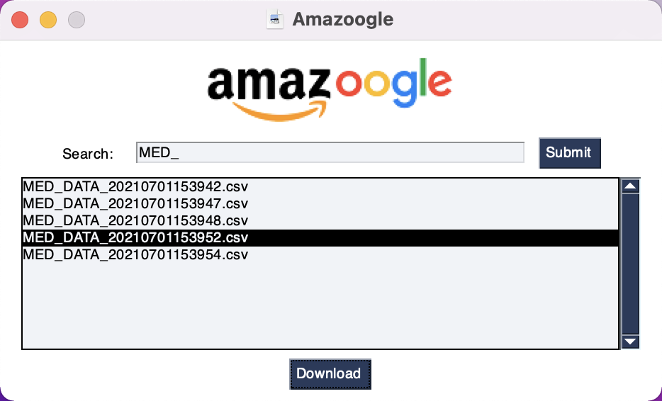
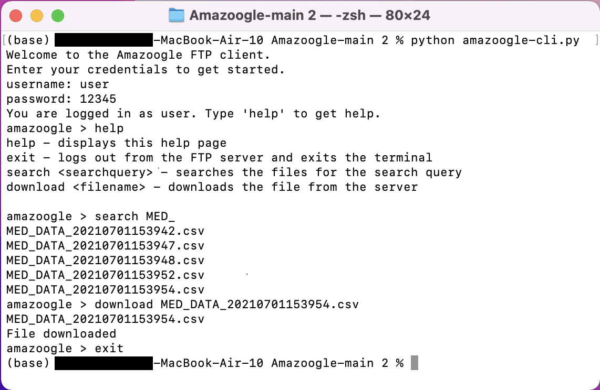

# Programming Project: Group 10

## By Gib.C, Benjamin.W1, Liam.S2, Lucy.S2

# The Project 

Our code: [https://github.com/Benjamin-W1/Amazoogle](https://github.com/Benjamin-W1/Amazoogle)

The FTP server has credentials:

* Username: user
* Password: 12345

## Prerequisite Python Modules

* **PySimpleGUI **(`pip install pysimplegui)`
* **Pathlib **(`pip install pathlib)`
* **Pyftpdlib **(`pip install pyftpdlib)`

# Task Delegation and Teamwork

To start with, we made a Github repository so that we could share our work and keep up to date with each other. This was really helpful for us to all work at the same time and we were able to access our work from different computers. 

Then we split the project into subproblems that we could solve mostly independently to allow us to work efficiently and whenever we wanted to without having to arrange a meeting. The four main sections that we identified were: interfaces (graphical and command line), file validation, FTP server/client and file archiving.

We were able to complete the task without an assigned leader, using task delegation as everyone was responsible for completing their own part and providing help to others. We determined who would do each section by discussing what we thought our individual strengths are and which subproblem we felt most capable of. We checked in regularly to discuss how our sections were going so we could help anyone that needed it and we could determine what to complete next.

When we had all finished our individual work, we had a Teams meeting to link our code together and determine which parts of the code needed to call others. We decided at the beginning to all use python and when we were coding we considered how our functions would interact with other parts of the project so this step was fairly easy.

# Lucy.S2: File Validation + Logging

My first task was to read in the files and parse the data. I used the csv python library, which allowed me to separate the rows and columns so I could loop through each row and column.

I then considered the issues that would cause a row to be invalid: incomplete row, a repeated batch id, containing an invalid value or containing the wrong headings (if it was the first row). To check if the row is incomplete, I compared the number of columns to the expected number. For the rest of the checks I needed to distinguish between the row being the first or not so I kept a count variable. If the row was the first I needed to check the headings were correct so I compared the columns in the row to an array of expected headings. For the other rows, I needed to check the batch id wasn’t repeated (by checking for it in a list of previously read batch ids) and that all the values were valid (by checking that each was a number less than or equal to 9.9).

After validating the data inside the file, I needed to validate the file name so I wrote a function that would remove the name from the end of the path and validate it using the python regex library.

At this point, the function would take a file path and return true or false to show if the file was valid. I then needed to create a log file to record any files that were determined to be invalid and the reasons. Using the python json library, I wrote a function that would take the file path and error message and append it to the log file.

I tested my code throughout development, making sure that it worked before adding more functionality. This was very useful for debugging because I could be confident that any problems were in the most recent addition to my code, allowing me to find the error quicker. I was also able to quickly run my tests I had made to ensure my code was working before making commits on Git.

# Benjamin.W1: GUI & CLI

My role was the design and creation of the Graphical User Interface and Command Line Interface. Once I had established what widgets the GUI would require I designed how it would look. I chose to create the interfaces using Python as it is the language I am best at and, originally, I started using the Tkinter module to create the GUI. However, I was finding it difficult to arrange the widgets using Tkinter and so another member of my team suggested using PySimpleGUI. I found PySimpleGui much easier to use and so I went about learning how to use it. Once I had a basic understanding of how to use the module I created a simple login page and search page. The login page had entry boxes for a username and password, both of which the ftp server required. The search page has a search box, a results box and a button to download the selected file. The results box is empty by default and gets populated with results once a search is submitted.

After I had created the GUI I started work on the Command Line Interface. The CLI was much easier as I had already worked out what features to include. I used a simple while True loop with an input for commands. The available commands are as follows:

* Help - displays the help page
* Exit - logs out from the FTP server and exits the terminal
* Search &lt;searchquery> - searches the server for the search query
* Download &lt;filename> - downloads the specified file from the server

Finally, I integrated my teammates' sections of the project into the interfaces. This meant importing the FTP code, file archiving, file validation and logging.

# Gib.C: File Archiving 

I was tasked with storing the files downloaded from the FTP server in a sensible and practical way. I decided on using Python for this project as it’s my best language and contains helpful modules able to interface with the windows directory. After some research on modules like _os _and _pathlib_ I decided on using _pathlib_ as it seemed simpler but still having the capabilities I needed. It works by taking in the file name and splicing it into its date/time segments using each numbers position in the string e.g. _string[9:13] _which results in the year the data was created. This hard coding only works as the files should have been validated already but if not a different approach would be necessary. Next using the _pathlib.path() _in conjunction with _path.mkdir(parents=True) _Creates a directory structure using each section of the date and time e.g. _Archive/year/month/day/… _and if it doesn’t exist already _parents=True_ will create what it needs to make it valid therefore storing everything in a nice format without having to make many many files for each year/month/day or risk the system not being able to find a path. Finally I simply used _shutil _with the files initial download path and the newly created path for it to move it into the organised structure.

# Liam.S2: FTP Client and Server Code

My focus was on implementing the File Transfer Protocol (FTP) server and client. With the aim of performing test-driven development, I began by producing a set of tests to allow me to check that my code was working. I then proceeded to write the code.

The decision to implement the client in Python was straightforward: the rest of the client was written in Python, and Python provided a library (`ftplib`) to assist. The server, being separate from the client, did not necessarily need to be written in Python. However, Python made the most sense in this case due to the availability of the `pyftpdlib` library.

As I needed to store an FTP object, I created a class on the client side. This was a logical decision as it allowed the client functionality to be encapsulated. The rest of the client could rely on the simple interface to perform the necessary tasks. If, in the future, a different – perhaps more secure – protocol was used on the server instead, it would only be this class that would need to change, with no significant changes to the rest of the program.

The server was fairly straightforward to implement, and I was able to make use of StackOverflow to assist me. For security reasons, I limited connections to one at a time: this is because only one is needed to accomplish the task, and allowing others to connect simultaneously is unnecessary. This can be trivially adapted if the end-users requirements were to change in the future – a single line of code would need to be changed.

I tested the FTP client and server separately before merging it in so that it could be used by the rest of the program.
